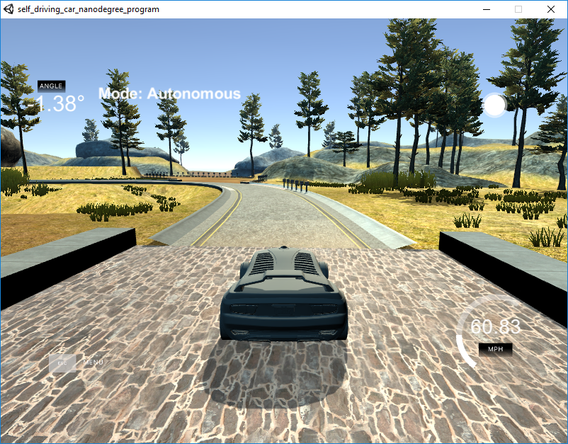

# PID Control

## Introduction

This project aim to implement a PID controller in C++ to . This Udacity simulator used in this project can be downloaded [here](https://github.com/udacity/self-driving-car-sim/releases). The communication between particle filter and simulator is based on [uWebSockets](https://github.com/uNetworking/uWebSockets).

## Basic Build Instructions
1. Clone this repo.
2. Make a build directory: `mkdir build && cd build`
3. Compile: `cmake .. && make`
4. Run it: `./pid`. 

## Parameter Tuning Strategy

1. The proportional portion (Kp) of PID controller try to keep vehicle close to the middle of the lane by steering wheel to the opposite direction of cross-track error (cte). However, a P controller will cause oscillation since it only response to present cte value and can not remove the accumulation of cte value. The accumulation of cte (in positive side or in negative side) will increase the magnitude of trajectory osccilation.

Therefore, in the beginning, I set Ki and Kd to 0, and test different Kp values (10, 1, 0.1, 0.01). The goal is to find out a Kp value keeping the vehicle in the middle of the lane as long as possible without serious oscillation. If Kp value set to a low value, the controller has no response to cte, the vehicle will deviate from the road ([video Kp=0.01](https://youtu.be/V-vgksMStyY)). On the contrary, if Kp value set to a high value, even very smooth curve will cause serious trajectory osccilation ([video Kp=1.0](https://youtu.be/GMa-TJJFF9s). Finally I set Kp to 0.1 ([video Kp=0.1](https://youtu.be/PCHf5BAB2tQ).

2. The derivative portion (Kd) of PID controller try to reduce the overshoot caused by the proportional portion (Kp). I increased Kd from 0 until the overshoot trajectory looks minimized. After I set Kd to 8.5, the simulator can finish the track 1 at low speed (30 MPH) without any problems.

3. The integral portion (Ki) of PID controller reduce the systematic bias by taking the integral of error into account. In the simulator, steering at high speed cause vehicle drift. By setting the Ki to proper number can compensate this error and the vehicle can driving at high speed smoothly. I end up setting Ki to 0.001.

## Results ([Click to video Kp=0.1 Ki=0.001 Kd=8.5](https://youtu.be/TU5EeDkZJnU))

With these parameters, the vehicle can drive at 60 MPH. To achieve higher speed, the parameters could be fine-tuned with numerical optimization algorithm.